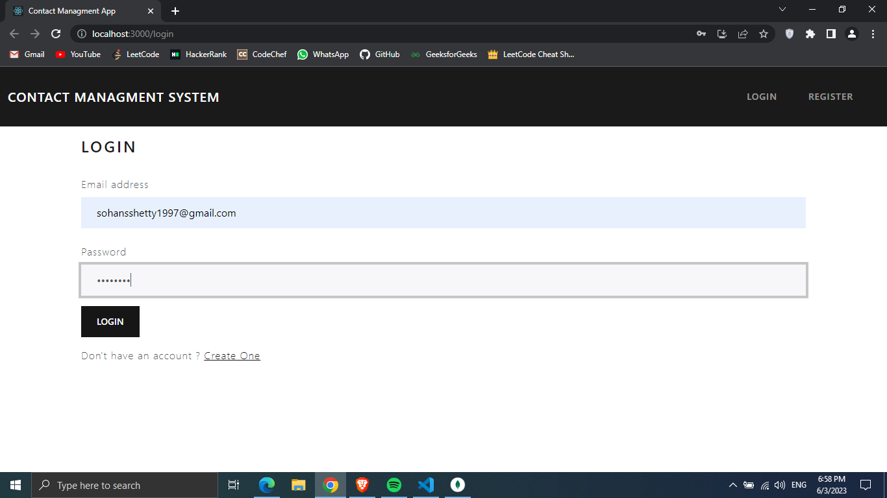
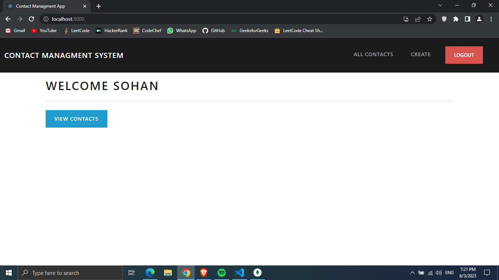
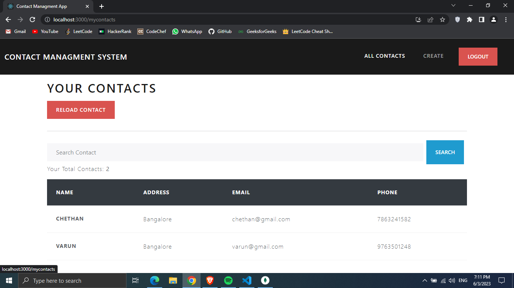
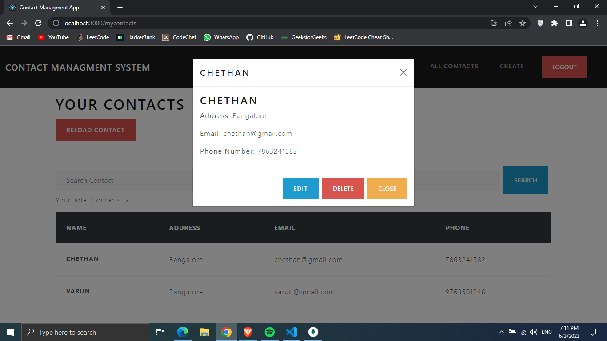
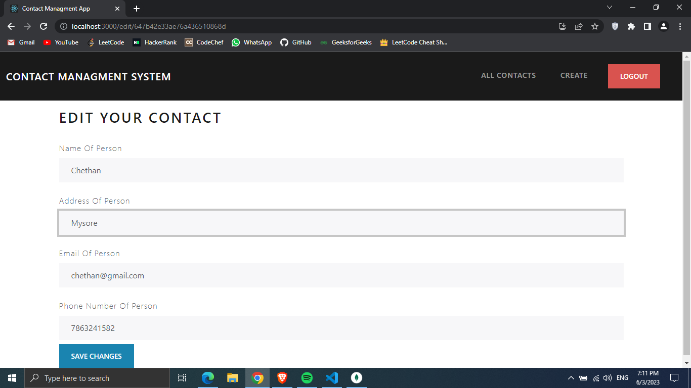
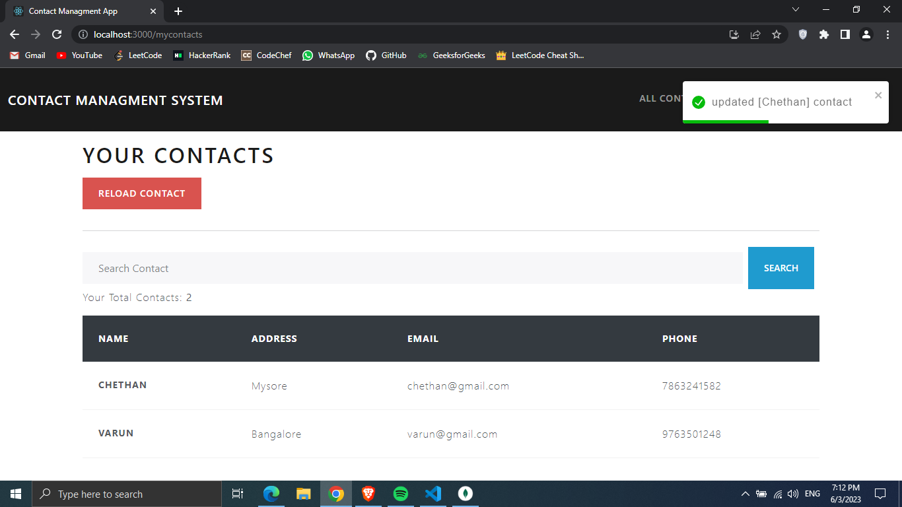

# Contact-app

It is a real-time contact manager application I developed using ReactJS, NodeJS, ExpressJS, and MongoDB. The platform allows users to manage
contacts in real-time without having to refresh the page.

# Screenshots

Login Page

Home Page

Create (Creates contacts)

All Contacts (Displays all contacts)

Modify contacts

Updated Contacts

